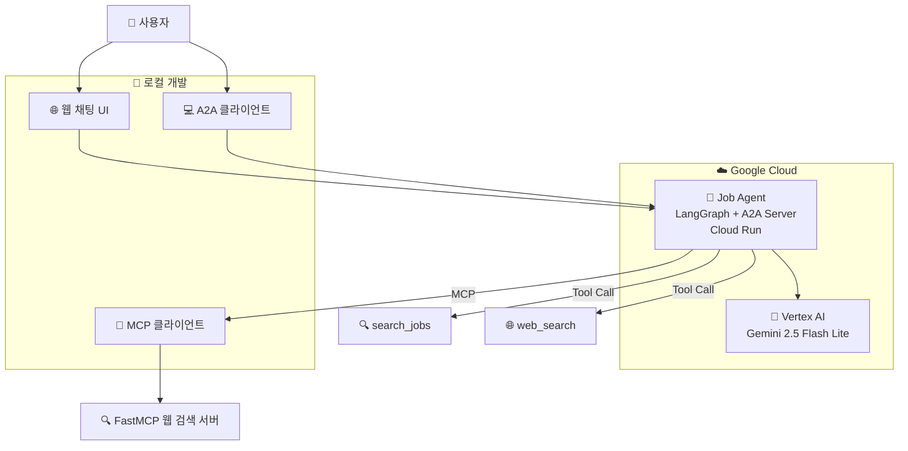

# Job Agent A2A - 프로젝트 아키텍처 및 코드 흐름

## 프로젝트 개요

이 저장소는 **Agent-to-Agent (A2A) 프로토콜**을 구현하는 독립 실행형 `job-agent/` 서비스를 포함합니다. `job-agent/` 컴포넌트는 독립적으로 작동하며 A2A 엔드포인트와 사용자 친화적인 채팅 UI를 모두 노출합니다.

## 주요 기술

- **A2A 프로토콜**: 에이전트 간 통신 표준
- **LangGraph**: Job Agent용 (ReAct 패턴)
- **FastMCP**: MCP 서버 구현 프레임워크
- **Vertex AI**: LLM 백엔드 (Gemini 2.5 Flash Lite)
- **Google Cloud Run**: 배포 플랫폼
- **Starlette**: 웹 UI 및 A2A 서버 프레임워크

## 프로젝트 구조

```
job_agent/
├── job-agent/                        # 독립 실행형 Job Agent 패키지
│   ├── __main__.py                   # A2A 서버 진입점 및 웹 UI 라우트
│   ├── agent.py                      # LangGraph 기반 Job Agent 구현
│   ├── agent_executor.py             # A2A 실행자 래퍼
│   ├── web_search_server.py          # FastMCP 웹 검색 서버
│   ├── test_cloud_run.py             # Cloud Run 테스트 스크립트
│   ├── Dockerfile                    # 컨테이너 정의
│   ├── pyproject.toml                # 프로젝트 의존성
│   └── README.md                     # 패키지 문서
├── cloudbuild.yaml                   # CI/CD 파이프라인
├── study/                            # 프로젝트 문서
│   ├── modules-reference.md          # 모듈 참조 가이드
│   └── project-architecture.md       # 아키텍처 문서
└── README.md                         # 프로젝트 개요
```

## 아키텍처 다이어그램 (Job Agent 중심)



## 코드 흐름 분석 (Job Agent)

### 1. 배포 흐름

#### A. Cloud Run 배포 (독립 실행형 서비스)
```bash
# Job Agent를 Cloud Run에 배포
cd job-agent
gcloud run deploy job-agent \
  --source . \
  --region us-central1 \
  --allow-unauthenticated \
  --set-env-vars GOOGLE_CLOUD_PROJECT=$PROJECT_ID,GOOGLE_CLOUD_LOCATION=us-central1

# 외부 URL을 Agent Card에 설정
URL=$(gcloud run services describe job-agent --region us-central1 --format='value(status.url)')
gcloud run services update job-agent --region us-central1 --update-env-vars HOST_OVERRIDE=$URL
```

#### B. CI/CD 파이프라인 배포
```yaml
# cloudbuild.yaml을 통한 자동 배포
# GitHub 푸시 시 자동으로 빌드 및 배포
```

### 2. 런타임 흐름 (Job Agent)

#### A. 내장 웹 UI를 통한 사용자 상호작용
```text
1) 브라우저 GET / (루트)에서 최소한의 채팅 페이지 로드
2) 사용자가 메시지를 입력하고 전송 버튼 클릭
3) 브라우저가 { text, contextId }와 함께 POST /chat 요청
4) 서버가 JobAgent.invoke(text, contextId) 호출
5) { reply } 응답이 반환되어 어시스턴트 버블로 렌더링
```
```python
# job-agent/__main__.py
async def chat_endpoint(request: Request) -> JSONResponse:
    data = await request.json()
    user_message = data.get("text")
    session_id = data.get("contextId", str(uuid.uuid4()))
    
    agent_instance = JobAgent()
    response = agent_instance.invoke(user_message, session_id)
    return JSONResponse({"reply": response, "contextId": session_id})
```

#### B. A2A 클라이언트 상호작용 (프로그래밍 방식)
```python
from a2a.client import A2ACardResolver, A2AClient
from a2a.types import SendMessageRequest, MessageSendParams

# Agent Card 발견 (/.well-known/agent.json)
resolver = A2ACardResolver(base_url=JOB_AGENT_URL, httpx_client=client)
card = await resolver.get_agent_card()
client = A2AClient(httpx_client=client, card=card, url=card.url)

# A2A 메시지 전송
payload = {"message": {"role": "user", "parts": [{"type": "text", "text": "Hello"}], "messageId": mid, "contextId": ctx}}
request = SendMessageRequest(id=mid, params=MessageSendParams.model_validate(payload))
resp = await client.send_message(request)
```
```python
# test_cloud_run.py
async def test_job_agent():
    # Job Agent의 Agent Card 발견
    resolver = A2ACardResolver(base_url=JOB_AGENT_URL, httpx_client=client)
    card = await resolver.get_agent_card()
    
    # A2A 클라이언트 생성
    client = A2AClient(httpx_client=client, card=card, url=card.url)
    
    # 메시지 전송 및 응답 수신
    message_request = create_message_request("구직 조언을 받고 싶습니다")
    response = await client.send_message(message_request)
    return response
```

#### C. A2A 실행자 처리 (Job Agent)
```python
# job-agent/agent_executor.py
class JobAgentExecutor(AgentExecutor):
    def __init__(self):
        self.agent = JobAgent()
        
    async def execute(self, context: RequestContext, event_queue: EventQueue) -> None:
        query = context.get_user_input()
        result = self.agent.invoke(query, context.context_id)
        
        parts = [Part(root=TextPart(text=str(result)))]
        await event_queue.enqueue_event(
            completed_task(context.task_id, context.context_id, [new_artifact(parts, f"agent_{context.task_id}")], [context.message])
        )
```

#### D. A2A 서버 설정 (Job Agent)
```python
# job-agent/__main__.py
def main(host, port):
    # 에이전트 기능 및 스킬 정의
    capabilities = AgentCapabilities(streaming=True)
    skill = AgentSkill(
        id="job_advisor", 
        name="Job Advisor", 
        description="커리어 및 구직 상담 어시스턴트", 
        examples=["이력서 작성 팁", "면접 준비", "커리어 경로 조언"]
    )
    
    # Agent Card 생성
    agent_card = AgentCard(
        name="job-agent",
        description="커리어 및 구직 상담을 도와주는 AI 어시스턴트",
        url=agent_host_url,
        version="1.0.0",
        defaultInputModes=Agent.SUPPORTED_CONTENT_TYPES,
        defaultOutputModes=Agent.SUPPORTED_CONTENT_TYPES,
        capabilities=capabilities,
        skills=[skill]
    )
    
    # A2A 서버 설정
    request_handler = DefaultRequestHandler(
        agent_executor=JobAgentExecutor(),
        task_store=InMemoryTaskStore()
    )
    server = A2AStarletteApplication(agent_card=agent_card, http_handler=request_handler)
    
    uvicorn.run(server.build(), host=host, port=port)
```

### 3. 에이전트 구현 (Job Agent)
```python
# job-agent/agent.py
class JobAgent:
    def __init__(self):
        self.model = ChatVertexAI(
            model="gemini-2.5-flash-lite", 
            project=os.getenv("GOOGLE_CLOUD_PROJECT"), 
            location=os.getenv("GOOGLE_CLOUD_LOCATION")
        )
        self.tools = [search_jobs, web_search]  # 구직 검색 및 웹 검색 도구
        self.graph = create_react_agent(
            self.model, 
            tools=self.tools, 
            checkpointer=memory, 
            prompt=self.SYSTEM_INSTRUCTION
        )

    def invoke(self, query, sessionId) -> str:
        config = {"configurable": {"thread_id": sessionId}}
        result = self.graph.invoke({"messages": [("user", query)]}, config)
        
        # 마지막 AI 메시지만 반환 (중복 방지)
        messages = result.get("messages", [])
        ai_messages = [msg for msg in messages if hasattr(msg, 'type') and msg.type == 'ai']
        if ai_messages:
            return ai_messages[-1].content
        
        return "죄송합니다. 응답을 생성할 수 없습니다."
```

### 4. UX 흐름 (Job Agent 웹 UI)
```text
페이지 로드:
  - GET /에서 정적 HTML 제공 (인라인 스타일 + 스크립트)
  - 스크립트가 contextId 초기화 및 클릭/Enter 핸들러 바인딩

메시지 전송:
  - 사용자 버블을 즉시 추가
  - { text, contextId }와 함께 POST /chat 요청
  - 성공 시: 응답과 함께 에이전트 버블 추가
  - 오류 시: 인라인 오류 버블 추가
```

### 5. 설정 (Job Agent)
환경 변수:
- `GOOGLE_CLOUD_PROJECT` (필수)
- `GOOGLE_CLOUD_LOCATION` (필수, 예: `us-central1`)
- `HOST_OVERRIDE` (선택사항; Agent Card에서 외부 URL 게시)

로컬 실행:
```bash
cd job-agent
uv sync
uv run . --host 0.0.0.0 --port 8080
```

Cloud Run 배포:
```bash
gcloud run deploy job-agent \
  --source ./job-agent \
  --region us-central1 \
  --allow-unauthenticated \
  --set-env-vars GOOGLE_CLOUD_PROJECT=$PROJECT_ID,GOOGLE_CLOUD_LOCATION=us-central1

URL=$(gcloud run services describe job-agent --region us-central1 --format='value(status.url)')
gcloud run services update job-agent --region us-central1 --update-env-vars HOST_OVERRIDE=$URL
```

### 6. 도구 구현
```python
# Job Agent의 도구 패턴
@tool
def search_jobs(query: str, location: str = "Remote", experience_level: str = "Entry") -> str:
    """주어진 기준에 따라 구직 기회를 검색합니다."""
    # 구직 검색 로직 구현
    return f"'{query}'에 대한 {total_found}개의 구직 기회를 찾았습니다."

@tool
def web_search(query: str, count: int = 5) -> str:
    """웹 검색을 수행하고 상위 결과를 반환합니다."""
    # DuckDuckGo를 사용한 웹 검색 구현
    return formatted_search_results
```

## 주요 구성 요소 상세 분석

### A2A 프로토콜 구성 요소
- **A2ACardResolver**: 기본 URL에서 에이전트 기능을 발견합니다
- **A2AClient**: 원격 에이전트에 메시지를 보냅니다
- **A2AStarletteApplication**: A2A 프로토콜을 위한 HTTP 서버
- **DefaultRequestHandler**: A2A 요청을 에이전트 실행자로 라우팅합니다
- **AgentCard**: 에이전트 기능, 스킬, 엔드포인트를 설명합니다

### LangGraph 구성 요소
- **create_react_agent**: ReAct 패턴 에이전트를 생성합니다
- **MemorySaver**: 대화 메모리를 위한 체크포인팅
- **ChatVertexAI**: Vertex AI LLM 통합

### 통신 흐름
1. **발견**: 클라이언트가 A2ACardResolver를 통해 Job Agent를 발견합니다
2. **연결**: A2AClient를 사용하여 Job Agent에 연결을 설정합니다
3. **메시징**: 사용자 쿼리와 함께 A2A SendMessageRequest를 전송합니다
4. **처리**: Job Agent가 요청을 처리하고 A2A 응답을 반환합니다
5. **응답**: 클라이언트가 응답을 받아 사용자에게 제공합니다

## 환경 변수

### Job Agent
```bash
GOOGLE_CLOUD_PROJECT=your-project-id
GOOGLE_CLOUD_LOCATION=us-central1
GOOGLE_GENAI_USE_VERTEXAI=True
HOST_OVERRIDE=https://your-agent-url.a.run.app  # 외부 카드 URL용
PORT=8080  # Cloud Run 기본값
```

## 테스트

프로젝트에는 배포된 에이전트를 테스트하기 위한 `test_cloud_run.py` 스크립트가 포함되어 있습니다:
```bash
cd job-agent
uv run test_cloud_run.py \
  --url https://job-agent-url.a.run.app \
  --text "구직 조언을 받고 싶습니다"
```

## 배포 명령

### Job Agent
```bash
# Cloud Run에 배포
cd job-agent
gcloud run deploy job-agent \
  --source . \
  --region us-central1 \
  --allow-unauthenticated \
  --set-env-vars GOOGLE_CLOUD_PROJECT=$PROJECT_ID,GOOGLE_CLOUD_LOCATION=us-central1

# 외부 URL을 Agent Card에 설정
URL=$(gcloud run services describe job-agent --region us-central1 --format='value(status.url)')
gcloud run services update job-agent --region us-central1 --update-env-vars HOST_OVERRIDE=$URL
```

### CI/CD 파이프라인
```bash
# GitHub 푸시 시 자동 배포
# cloudbuild.yaml을 통한 자동화된 빌드 및 배포
```

이 아키텍처는 현대적인 클라우드 네이티브 AI 프레임워크를 사용하는 정교한 단일 에이전트 시스템을 보여주며, 각 구성 요소가 특정 책임을 가지고 명확한 통신 프로토콜을 따릅니다.
