# Purchasing Concierge A2A - Project Architecture & Code Flow

## Project Overview

This repository also includes a standalone `job-agent/` service implementing the **Agent-to-Agent (A2A) protocol**. The `job-agent/` component can operate independently of the purchasing concierge and exposes both A2A endpoints and a human-friendly chat UI.

## Key Technologies

- **A2A Protocol**: Agent-to-Agent communication standard
- **Google ADK (Agent Development Kit)**: Framework for building AI agents
- **LangGraph**: For pizza and job agents (ReAct pattern)
- **CrewAI**: For burger agent
- **Vertex AI**: LLM backend (Gemini 2.5 Flash Lite)
- **Google Cloud Run**: Deployment platform
- **Gradio**: Web UI for the main purchasing concierge

## Project Structure

```
purchasing-concierge-a2a/
├── main.py                           # Simple entry point (placeholder)
├── purchasing_concierge_ui.py        # Gradio web interface for Agent Engine deployment
├── deploy_to_agent_engine.py         # Vertex AI Agent Engine deployment script
├── purchasing_concierge/             # Main orchestrating agent
│   ├── __init__.py                   # Exports root_agent
│   ├── agent.py                      # ADK Agent wrapper (placeholder)
│   ├── purchasing_agent.py           # Core orchestrating logic
│   ├── remote_agent_connection.py    # A2A client wrapper
│   └── README.md                     # Empty
└── remote_seller_agents/             # Independent A2A server agents (reference)
    ├── pizza_agent/                  # LangGraph-based pizza seller
    │   ├── __main__.py               # A2A server entry point
    │   ├── agent.py                  # Pizza agent implementation
    │   ├── agent_executor.py         # A2A executor wrapper
    │   ├── test_cloud_run.py         # Cloud Run testing script
    │   └── Dockerfile                # Container definition
    ├── burger_agent/                 # CrewAI-based burger seller
    │   ├── __main__.py               # A2A server entry point
    │   ├── agent.py                  # Burger agent implementation
    │   ├── agent_executor.py         # A2A executor wrapper
    │   └── Dockerfile                # Container definition
    └── job_agent/                    # LangGraph-based job advisor (Korean)
        ├── __main__.py               # A2A server entry point
        ├── agent.py                  # Job agent implementation (MISNAMED - actually pizza logic)
        ├── agent_executor.py         # A2A executor wrapper
        ├── test_cloud_run.py         # Cloud Run testing script
        └── Dockerfile                # Container definition
```

## Architecture Diagram (job-agent focus)

```mermaid
graph TB
    User[👤 User] --> UI[🌐 Gradio UI]
    User --> CLI[💻 CLI/API]
    
    UI --> JA[💼 Job Agent<br/>LangGraph + A2A Server<br/>Cloud Run]
    CLI --> JA
    
    Pizza --> |Tool Call| PizzaOrder[📦 create_pizza_order]
    Burger --> |Tool Call| BurgerOrder[📦 create_burger_order]
    Job --> |Tool Call| JobOrder[📦 create_pizza_order ⚠️]
    
    subgraph "☁️ Google Cloud"
        AE
        Pizza
        Burger
        Job
    end
    
    subgraph "🔧 Local Development"
        UI
        CLI
    end
```



## Code Flow Analysis (job-agent)

### 1. Deployment Flow

#### A. Agent Engine Deployment (Main Orchestrator)
```python
# deploy_to_agent_engine.py
vertexai.init(project=PROJECT_ID, location=LOCATION, staging_bucket=STAGING_BUCKET)
adk_app = reasoning_engines.AdkApp(agent=root_agent)
remote_app = agent_engines.create(
    agent_engine=adk_app,
    display_name="purchasing-concierge",
    requirements=["google-cloud-aiplatform[adk,agent_engines]", "a2a-sdk==0.2.16"],
    extra_packages=["./purchasing_concierge"],
    env_vars={
        "PIZZA_SELLER_AGENT_URL": "https://pizza-agent-url",
        "BURGER_SELLER_AGENT_URL": "https://burger-agent-url"
    }
)
```

#### B. Job Agent Deployment
```bash
# Each agent deployed separately to Cloud Run
cd remote_seller_agents/pizza_agent
gcloud run deploy pizza-agent --source . --allow-unauthenticated

cd ../burger_agent  
gcloud run deploy burger-agent --source . --allow-unauthenticated

cd ../job_agent
gcloud run deploy job-agent --source . --allow-unauthenticated
```

### 2. Runtime Flow (job-agent)

#### A. User Interaction via Built-in Web UI
```text
1) Browser GET / (root) loads minimal chat page
2) User types a message and clicks Send
3) Browser POST /chat with { text, contextId }
4) Server calls JobAgent.invoke(text, contextId)
5) Response { reply } returned and rendered as assistant bubble
```
```python
# purchasing_concierge_ui.py
async def get_response_from_agent(message: str, history: List[Dict[str, Any]]) -> str:
    # Connect to deployed Agent Engine
    REMOTE_APP = agent_engines.get(os.getenv("AGENT_ENGINE_RESOURCE_NAME"))
    SESSION_ID = REMOTE_APP.create_session(user_id=USER_ID)["id"]
    
    # Stream query to purchasing agent
    for event in REMOTE_APP.stream_query(
        user_id=USER_ID,
        session_id=SESSION_ID, 
        message=message
    ):
        # Process function_call, function_response, text parts
        # Return formatted responses
```

#### B. A2A Client Interaction (Programmatic)
```python
from a2a.client import A2ACardResolver, A2AClient
from a2a.types import SendMessageRequest, MessageSendParams

resolver = A2ACardResolver(base_url=JOB_AGENT_URL, httpx_client=client)
card = await resolver.get_agent_card()
client = A2AClient(httpx_client=client, card=card, url=card.url)

payload = {"message": {"role": "user", "parts": [{"type": "text", "text": "Hello"}], "messageId": mid, "contextId": ctx}}
request = SendMessageRequest(id=mid, params=MessageSendParams.model_validate(payload))
resp = await client.send_message(request)
```
```python
# purchasing_concierge/purchasing_agent.py
class PurchasingAgent:
    def __init__(self, remote_agent_addresses: List[str]):
        self.remote_agent_connections: dict[str, RemoteAgentConnections] = {}
        
    async def before_agent_callback(self, callback_context: CallbackContext):
        # Initialize A2A connections to all remote agents
        for address in self.remote_agent_addresses:
            card_resolver = A2ACardResolver(base_url=address, httpx_client=httpx_client)
            card = await card_resolver.get_agent_card()
            remote_connection = RemoteAgentConnections(agent_card=card, agent_url=card.url)
            self.remote_agent_connections[card.name] = remote_connection
            
    async def send_task(self, agent_name: str, task: str, tool_context: ToolContext):
        # Send A2A message to specific remote agent
        client = self.remote_agent_connections[agent_name]
        payload = {
            "message": {
                "role": "user",
                "parts": [{"type": "text", "text": task}],
                "messageId": message_id,
                "contextId": session_id
            }
        }
        message_request = SendMessageRequest(id=message_id, params=MessageSendParams.model_validate(payload))
        send_response = await client.send_message(message_request)
        return send_response.root.result
```

#### C. Remote Agent Processing (A2A Executor)
```python
# remote_seller_agents/*/agent_executor.py (Common Pattern)
class [Agent]Executor(AgentExecutor):
    def __init__(self):
        self.agent = [SpecificAgent]()
        
    async def execute(self, context: RequestContext, event_queue: EventQueue) -> None:
        query = context.get_user_input()
        result = self.agent.invoke(query, context.context_id)
        
        parts = [Part(root=TextPart(text=str(result)))]
        await event_queue.enqueue_event(
            completed_task(context.task_id, context.context_id, [new_artifact(parts, f"agent_{context.task_id}")], [context.message])
        )
```

#### D. A2A Server Setup (Job Agent)
```python
# remote_seller_agents/*/__main__.py (Common Pattern)
def main(host, port):
    # Define agent capabilities and skills
    capabilities = AgentCapabilities(streaming=True)
    skill = AgentSkill(id="agent_id", name="Agent Name", description="...", examples=["..."])
    
    # Create agent card
    agent_card = AgentCard(
        name="agent_name",
        description="...",
        url=agent_host_url,
        version="1.0.0",
        defaultInputModes=Agent.SUPPORTED_CONTENT_TYPES,
        defaultOutputModes=Agent.SUPPORTED_CONTENT_TYPES,
        capabilities=capabilities,
        skills=[skill]
    )
    
    # Setup A2A server
    request_handler = DefaultRequestHandler(
        agent_executor=AgentExecutor(),
        task_store=InMemoryTaskStore()
    )
    server = A2AStarletteApplication(agent_card=agent_card, http_handler=request_handler)
    
    uvicorn.run(server.build(), host=host, port=port)
```

### 3. Agent Implementation (job-agent)
```python
# job-agent/agent.py
class JobAgent:
    def __init__(self):
        self.model = ChatVertexAI(model="gemini-2.5-flash-lite", project=os.getenv("GOOGLE_CLOUD_PROJECT"), location=os.getenv("GOOGLE_CLOUD_LOCATION"))
        self.tools = [search_jobs]  # Job search tool
        self.graph = create_react_agent(self.model, tools=self.tools, checkpointer=memory, prompt=self.SYSTEM_INSTRUCTION)

    def invoke(self, query, sessionId) -> str:
        config = {"configurable": {"thread_id": sessionId}}
        self.graph.invoke({"messages": [("user", query)]}, config)
        return self.get_agent_response(config)
```

### 4. UX Flow (job-agent web UI)
```text
Page load:
  - GET / serves static HTML (inline styles + script)
  - Script initializes contextId and binds click/Enter handlers

Sending a message:
  - Adds user bubble immediately
  - POST /chat with { text, contextId }
  - On success: appends agent bubble with reply
  - On error: appends inline error bubble
```

### 5. Configuration (job-agent)
Environment variables:
- `GOOGLE_CLOUD_PROJECT` (required)
- `GOOGLE_CLOUD_LOCATION` (required, e.g., `us-central1`)
- `HOST_OVERRIDE` (optional; publish external URL in Agent Card)

Local run:
```bash
cd job-agent
uv sync
uv run . --host 0.0.0.0 --port 8080
```

Cloud Run deploy:
```bash
gcloud run deploy job-agent \
  --source ./job-agent \
  --region us-central1 \
  --allow-unauthenticated \
  --set-env-vars GOOGLE_CLOUD_PROJECT=$PROJECT_ID,GOOGLE_CLOUD_LOCATION=us-central1

URL=$(gcloud run services describe job-agent --region us-central1 --format='value(status.url)')
gcloud run services update job-agent --region us-central1 --update-env-vars HOST_OVERRIDE=$URL
```

#### A. LangGraph Pattern (Pizza & Job Agents)
```python
# Uses LangGraph's create_react_agent with tools
class PizzaSellerAgent:
    def __init__(self):
        self.model = ChatVertexAI(model="gemini-2.5-flash-lite")
        self.tools = [create_pizza_order]
        self.graph = create_react_agent(self.model, tools=self.tools, checkpointer=memory, prompt=self.SYSTEM_INSTRUCTION)
        
    def invoke(self, query, sessionId) -> str:
        config = {"configurable": {"thread_id": sessionId}}
        self.graph.invoke({"messages": [("user", query)]}, config)
        return self.get_agent_response(config)
```

#### B. CrewAI Pattern (Burger Agent)
```python
# Uses CrewAI's Agent and Crew orchestration
class BurgerSellerAgent:
    def invoke(self, query, sessionId) -> str:
        model = LLM(model="vertex_ai/gemini-2.5-flash-lite")
        burger_agent = Agent(role="Burger Seller Agent", tools=[create_burger_order], llm=model)
        agent_task = Task(description=self.TaskInstruction, agent=burger_agent)
        crew = Crew(tasks=[agent_task], agents=[burger_agent], process=Process.sequential)
        
        inputs = {"user_prompt": query, "session_id": sessionId}
        response = crew.kickoff(inputs)
        return response
```

### 4. Tool Implementation
```python
# Common pattern across all agents
@tool
def create_[item]_order(order_items: list[OrderItem]) -> str:
    order_id = str(uuid.uuid4())
    order = Order(order_id=order_id, status="created", order_items=order_items)
    return f"Order {order.model_dump()} has been created"
```

## Key Components Deep Dive

### A2A Protocol Components
- **A2ACardResolver**: Discovers agent capabilities from base URL
- **A2AClient**: Sends messages to remote agents
- **A2AStarletteApplication**: HTTP server for A2A protocol
- **DefaultRequestHandler**: Routes A2A requests to agent executors
- **AgentCard**: Describes agent capabilities, skills, and endpoints

### ADK Components
- **Agent**: ADK agent wrapper with tools and callbacks
- **AgentExecutor**: Interface between A2A and actual agent logic
- **InMemoryTaskStore**: Stores task state for A2A protocol

### Communication Flow
1. **Discovery**: Purchasing agent discovers remote agents via A2ACardResolver
2. **Connection**: Establishes A2AClient connections to each remote agent
3. **Routing**: ADK agent decides which remote agent to contact
4. **Messaging**: Sends A2A SendMessageRequest with user query
5. **Processing**: Remote agent processes request and returns A2A response
6. **Aggregation**: Purchasing agent combines responses and returns to user

## Environment Variables

### Purchasing Concierge
```bash
GOOGLE_CLOUD_PROJECT=your-project-id
GOOGLE_CLOUD_LOCATION=us-central1
GOOGLE_GENAI_USE_VERTEXAI=True
STAGING_BUCKET=gs://your-staging-bucket
AGENT_ENGINE_RESOURCE_NAME=projects/.../locations/.../reasoningEngines/...
PIZZA_SELLER_AGENT_URL=https://pizza-agent-url.a.run.app
BURGER_SELLER_AGENT_URL=https://burger-agent-url.a.run.app
```

### Remote Agents
```bash
GOOGLE_CLOUD_PROJECT=your-project-id
GOOGLE_CLOUD_LOCATION=us-central1
HOST_OVERRIDE=https://your-agent-url.a.run.app  # For external card URL
PORT=8080  # Cloud Run default
```

## Issues Found

1. **Job Agent Misconfiguration**: `job_agent/agent.py` contains pizza agent logic instead of job-related logic
2. **Tool Naming**: Job agent uses `create_pizza_order` tool instead of job-specific tools
3. **System Instructions**: Job agent has pizza store instructions in Korean context

## Testing

The project includes `test_cloud_run.py` script for testing deployed agents:
```bash
cd purchasing-concierge-a2a
uv run remote_seller_agents/job_agent/test_cloud_run.py \
  --url https://job-agent-url.a.run.app \
  --text "Test message"
```

## Deployment Commands

### Remote Agents
```bash
# Deploy each agent individually
gcloud run deploy [agent-name] --source . --allow-unauthenticated --set-env-vars="GOOGLE_CLOUD_PROJECT=$PROJECT,GOOGLE_CLOUD_LOCATION=$LOCATION"
```

### Purchasing Concierge
```bash
# Deploy to Agent Engine
python deploy_to_agent_engine.py

# Run UI locally against deployed Agent Engine
python purchasing_concierge_ui.py
```

This architecture demonstrates a sophisticated multi-agent system using modern cloud-native AI frameworks, with each component having specific responsibilities and clear communication protocols.
